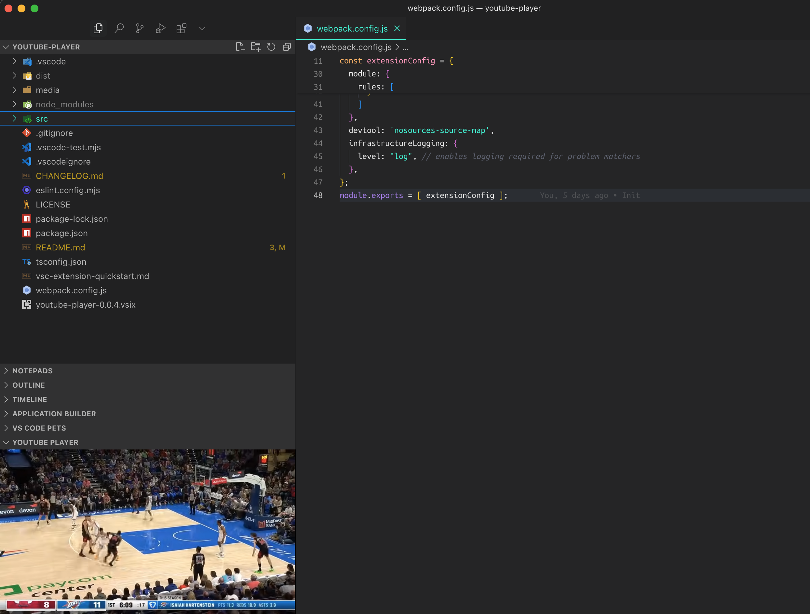
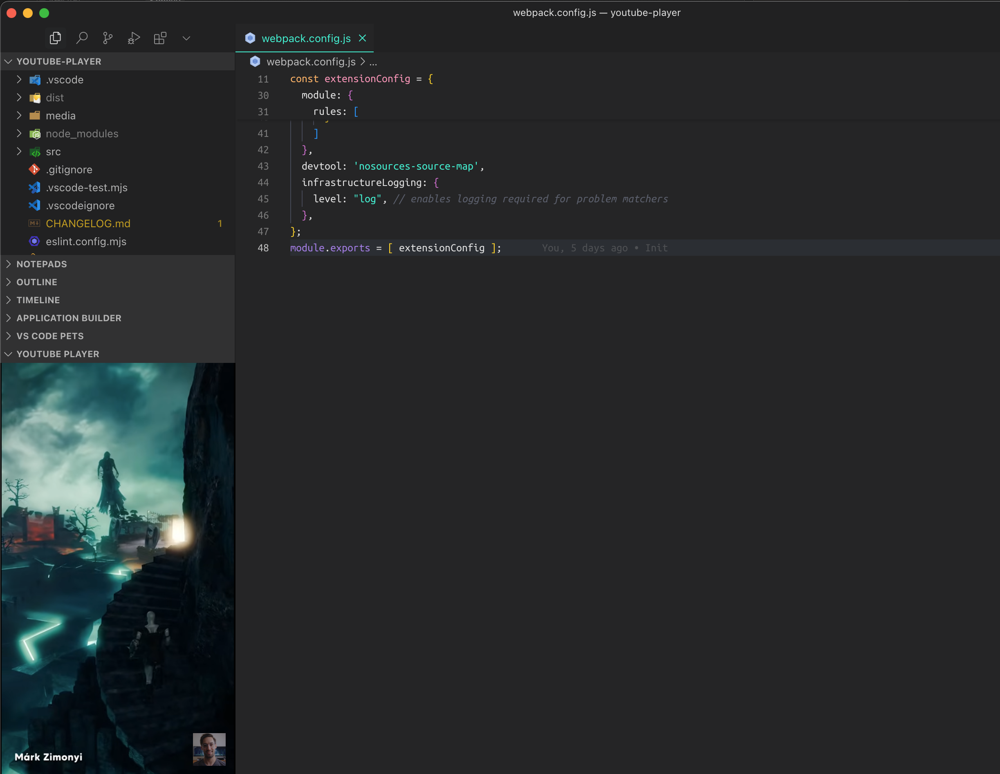

# YouTube Player for VS Code

Watch YouTube videos directly within Visual Studio Code! This extension allows you to play YouTube videos in a dedicated view, making it easy to follow tutorials or watch educational content while coding.

## Features

- 🎥 Play YouTube videos directly in VS Code
- 📝 Add videos via URL or command palette
- 📋 Maintain a history of recently watched videos (up to 30)
- ⏯️ Preserve video playback state (pause position, etc.)
- 🎯 Quick access through VS Code's sidebar

## Installation

1. Open VS Code
2. Press `Ctrl+Shift+X` (Windows/Linux) or `Cmd+Shift+X` (Mac) to open the Extensions view
3. Search for "YouTube Player"
4. Click Install

## Usage

### Playing a Video

1. Open the YouTube Player view from the sidebar
2. Click the "+" button or use the command palette and Type "YouTube Player: Play Video"
3. Enter a YouTube URL (e.g., https://www.youtube.com/watch?v=...)
4. The video will start playing automatically

### Viewing History

1. Open the command palette (`Ctrl+Shift+P` or `Cmd+Shift+P`)
2. Type "YouTube Player: Show History"
3. Select a video from your history to play it

## Screenshots

## Requirements

- VS Code version 1.74.0 or higher

## Extension Settings

This extension contributes the following settings:

* `youtubePlayer.maxHistoryItems`: Maximum number of videos to keep in history (default: 30)

## Release Notes

### 1.0.0

Initial release of YouTube Player for VS Code:
- Basic video playback functionality
- Video history management
- Playback state preservation
- Command palette integration

---

**Enjoy coding with YouTube!** 🚀
